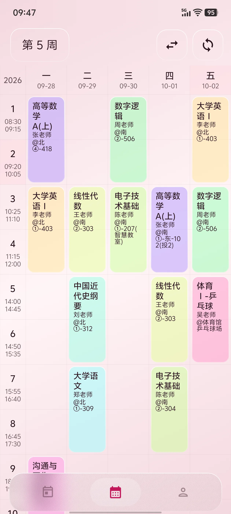

<div align="center">


# ClassFlow

**为 WBUer 打造的轻量课程表 · 武汉商学院定制版拾光课程表**

[](https://gitee.com/hjwqa/class-flow/releases)
[](https://gitee.com/hjwqa/class-flow/releases)
[](https://kotlinlang.org)
[](LICENSE)

[下载安装](#下载安装) · [功能特性](#功能特性) · [界面预览](#界面预览) · [常见问题](#常见问题) · [构建与开发](#构建与开发) · [English](README_EN.md)

</div>

> **English in a nutshell** — ClassFlow is a lightweight, open-source Android timetable app built with Jetpack Compose, tailored for **Wuhan Business University (WBU)**. It syncs your timetable straight from the academic system in one tap, bundles campus utilities (grades, empty classrooms, academic progress, library, campus card, QR scan-to-login), and lets you make the schedule yours with glassmorphism styling, wallpapers and native widgets. It is a derivative work of [shiguangschedule (拾光课程表)](https://github.com/XingHeYuZhuan/shiguangschedule). 👉 **[Full English documentation](README_EN.md)**

---

## 项目简介

**ClassFlow** 是 [拾光课程表](https://github.com/XingHeYuZhuan/shiguangschedule) 面向 **武汉商学院（WBU）** 的定制分支：保留上游轻量、优雅的课表体验，补齐了 WBU 教务系统的一键登录同步、校园内网 / WebVPN 自动路由，以及成绩、空教室、学业进程、图书馆、一卡通等常用校园服务。

- 📱 **平台**：Android 8.0（API 26）及以上，按 CPU 架构分包（arm64-v8a / armeabi-v7a / x86_64）
- 🚀 **分发**：[Gitee Releases](https://gitee.com/hjwqa/class-flow/releases)（主要）、[GitHub](https://github.com/shiro123444/ClassFlow)（源码）
- 🫶 **定位**：仅对标武汉商学院。其它学校请前往 [拾光课程表主仓库](https://github.com/XingHeYuZhuan/shiguangschedule)

> ∠・ω< )⌒☆ Ciallo～

## 功能特性

### 📚 课表

- **两种视图**：周课表 + 今日课表，左右滑动切换周次，底部 Dock 快速切换
- **多课表管理**：按学期建表、绑定学号、锁定并归档，避免网络同步误覆盖；多学期互不干扰
- **长按微调**：拖动上下端点快速缩放节数、拖拽卡片调整上课时间、拖至屏幕边缘跨周移动
- **冲突排版**：同格冲突课程自动分列穿插或截断对齐（可开关），同格多课支持虚线分割
- **显示选项**：24 小时时间轴模式、隐藏节次具体时间、隐藏日期、显示非本周课程
- **导出**：ICS 日历文件、WakeUp 课程表、无色高清长图，支持同步到系统日历

### 🔐 教务同步

- **一键登录同步**：自动探测校园网，直连 / WebVPN 智能切换，登录后直接导入课表
- **登录编排统一**：密码 + 图形验证码、短信二次验证、滑块验证码、二维码、证书异常询问，全部收敛到同一套弹窗
- **WebVPN 门户直登**：9 位学号与 8 位工号可直接登录 WebVPN 门户（其它格式自动解析），凭据页可只认证门户
- **导入体验**：任意可用学期选择、多校区作息模板、真实学号提取、课表元数据回写与规范重命名

### 🏫 校园服务

| 服务 | 说明 |
| --- | --- |
| 成绩查询 | 按学期查看成绩与绩点 |
| 空教室查询 | 按时间 / 教学楼筛选空闲教室 |
| 学业进程 | 学业完成度、课程分类进度 |
| 图书馆 | 馆藏检索、借阅记录、续借 |
| 一卡通 | 余额、明细账单、生活缴费入口 |
| 扫一扫 | 本机替电脑完成统一认证扫码登录（置 2 → 置 1）；ML Kit / ZXing 双引擎可切换，支持相册选图识别 |
| U净设备 | 饮水机 / 吹风机 / 洗衣机烘干机二维码直达（含支付宝 NFC 与 U净） |
| 桌面快捷方式 | 长按图标「扫一扫」「一卡通」直达 |

### 👤 账号与凭据

- 按服务类型（统一认证 / 教务 / 图书馆 / WebVPN / 一卡通 / WebDAV）分区管理，支持进入页面时自动验证会话（可关）
- 凭据按「**服务 × 账号**」两维存储，多账号就绪；旧版扁平数据一次性安全迁移
- **真实登出**：清除会话会先向服务端注销（CAS 吊销 `CASTGC`、教务作废 `jw_uf`、图书馆销毁 `PHPSESSID`、WebVPN 注销 `TWFID`）
- **高级模式**：连点页面标题 3 次，可查看 / 编辑会话凭据（如 `TWFID`、`jw_uf`）
- 登录失败按会话快照回滚，**不清空既有凭据**；统一认证可与 WebVPN / 校园网解耦，只续期 `CASTGC`

### 🎨 个性化与小组件

- **毛玻璃课表**：棱角 / 清透 / 磨砂 / 液态四种预设，模糊度、背景遮罩可调
- **壁纸**：自定义课表背景，双指缩放、拖动平移、模糊处理
- **字体与配色**：默认 / 平方 / 圆润 / 衬线字体风格；Sakura 时间色板按早 / 中 / 晚自动换色；浅色 / 深色主题
- **原生小组件**：今日课程 4x3 / 4x2、紧凑课程 2x2、超小课程 2x1、近日课程 4x2
- **多语言**：简体中文 / 繁体中文 / English

### 🔄 更新

- **应用内自更新**：走 `PackageInstaller` 会话安装——Android 12+ 条件满足时对自身更新**静默安装**；否则拉起系统确认界面；缺少「安装未知应用」权限时引导授权并在返回后自动重试；会话异常自动回退系统安装器
- 启动时静默检查更新（可关）、跳过指定版本、支持自定义更新源

## 界面预览

<div align="center">

| 周课表 | 个性化配置 | 桌面小组件 |
| :---: | :---: | :---: |
|  |  |  |

</div>

## 下载安装

| 渠道 | 地址 | 说明 |
| --- | --- | --- |
| **Gitee Releases**（推荐） | <https://gitee.com/hjwqa/class-flow/releases> | 国内直连，下载 APK |
| GitHub 仓库 | <https://github.com/shiro123444/ClassFlow> | 源码、Issue、PR |

APK 按 CPU 架构分包，请选择与自己设备匹配的版本：

| 架构 | 适用设备 | 直接下载（v1.1.2） |
| --- | --- | --- |
| `arm64-v8a` | 2017 年之后绝大多数手机（**推荐**） | [app-prod-arm64-v8a-release.apk](https://gitee.com/hjwqa/class-flow/releases/download/v1.1.2/app-prod-arm64-v8a-release.apk) |
| `armeabi-v7a` | 老旧 32 位机型 | [app-prod-armeabi-v7a-release.apk](https://gitee.com/hjwqa/class-flow/releases/download/v1.1.2/app-prod-armeabi-v7a-release.apk) |
| `x86_64` | 模拟器、部分平板 | [app-prod-x86_64-release.apk](https://gitee.com/hjwqa/class-flow/releases/download/v1.1.2/app-prod-x86_64-release.apk) |

- 系统要求：Android 8.0（API 26）及以上，单个安装包约 11–14 MB
- 首次安装需在系统设置中允许「安装未知应用」；安装后应用内可自动更新
- `dev` 开发者版包名为 `com.shiro.classflow.dev`，可与正式版共存
- 版本号以 [Releases](https://gitee.com/hjwqa/class-flow/releases) 页面为准

## 快速上手

1. **安装并打开**：首次进入按引导设置开学日期（未设置时无法准确显示当前周次）
2. **登录同步**：课表页右上角「登录同步」或「我的 → 账号与凭据」，选择直连 / WebVPN 登录统一认证，一键导入本学期课表
3. **调成自己的样子**：「我的 → 个性化配置」里换毛玻璃预设、设背景壁纸与字体，或添加桌面小组件

## 常见问题

<details>
<summary><b>只有武汉商学院能用吗？</b></summary>

是的，本项目仅针对 WBU 的教务与校园服务适配。其它学校请使用 [拾光课程表](https://github.com/XingHeYuZhuan/shiguangschedule)，或参考上游自行适配。

</details>

<details>
<summary><b>会把我的账号密码上传到服务器吗？</b></summary>

不会。凭据仅保存在本机应用私有存储中，登录请求直接发往学校自己的系统；本项目不提供任何中转或收集服务。「检查更新」只请求版本信息接口，可关闭，也可改成你自己的更新源。

</details>

<details>
<summary><b>安装时被系统拦截 / 无法安装？</b></summary>

Android 需要你手动允许「安装未知应用」：设置 → 应用 → 特殊应用权限 → 安装未知应用 → 允许你使用的浏览器或文件管理器。应用内更新如果缺少该权限，会引导你授权并在返回后自动重试。

</details>

<details>
<summary><b>支持平板、模拟器吗？</b></summary>

支持。界面按可用区域自适应横屏与平板；模拟器请选择 `x86_64` 安装包。目前没有 iOS 版本。

</details>

<details>
<summary><b>教务系统改版导致同步失败怎么办？</b></summary>

校园接口依赖学校系统页面结构，改版后可能需要跟进适配。请到 [Issues](https://github.com/shiro123444/ClassFlow/issues) 反馈，附上失败现象与时间。

</details>

<details>
<summary><b>怎么反馈问题或提建议？</b></summary>

推荐 [GitHub Issues](https://github.com/shiro123444/ClassFlow/issues)，也可以加入 QQ 用户群 **1050669511**（系列产品群：**133364402**）交流。

</details>

## 技术栈

| 分类 | 技术 |
| --- | --- |
| 语言 / 构建 | Kotlin 2.4、Gradle 9（Kotlin DSL + Version Catalog）、JDK 21、AGP 9 |
| UI | Jetpack Compose + Material 3、Navigation 3、Coil、Haze（毛玻璃）、小组件原生渲染 |
| 架构 | MVVM + Hilt 依赖注入、Coroutines / Flow |
| 数据 | Room、Proto DataStore、kotlinx.serialization、Wire（protobuf） |
| 网络 | OkHttp、Ktor、Jsoup（教务 / 校园页面解析） |
| 硬件 | CameraX、ML Kit Barcode / ZXing（扫码）、WorkManager（后台任务） |
| 其它 | JGit、AppCompat DayNight（语言切换）、Apache-2.0 许可合规插件 |

## 构建与开发

**环境要求**：JDK 21、Android SDK（`compileSdk = 37`）、Git。

```bash
git clone https://github.com/shiro123444/ClassFlow.git
cd ClassFlow
```

在项目根目录的 `local.properties`（已被 Git 忽略）中补充配置：

```properties
# U净 NFC / DeepLink 域名：必填，缺失会直接构建失败（避免打出指向错误域名的包）
CLASSFLOW_UJING_NFC_HOST=ujing.example.edu.cn
# 可选：通用链接节点（/url/、/u/）hub 域名；缺省时回落到上面的 U净 域名
CLASSFLOW_LINK_HUB_HOST=hub.example.com
# 可选（仅 debug 构建生效）：通用链接节点本地联调地址，配合 `adb reverse` 用本地服务端跑通读侧
# CLASSFLOW_LINK_HUB_DEBUG_BASE=http://127.0.0.1:8090
# 可选：应用内更新接口地址
CLASSFLOW_UPDATE_API_URL=https://example.com/classflow/update
# 可选：指定本机 JDK
org.gradle.java.home=C:\\path\\to\\jdk-21
```

同一配置也可通过 Gradle 属性（`-PCLASSFLOW_UJING_NFC_HOST=...`）或环境变量注入，优先级：Gradle 属性 > `local.properties` > 环境变量。

```bash
./gradlew :app:testDevDebugUnitTest   # 单元测试
./gradlew :app:assembleDevDebug       # 开发者版（可与正式版共存）
./gradlew :app:assembleProdRelease    # 正式版（按 ABI 分包）
```

- 正式包签名通过 `-Pandroid.injected.signing.*` 注入；本地 release 默认使用 debug 签名，仅供测试
- CI 见 [`.github/workflows/android-build.yml`](.github/workflows/android-build.yml)（手动触发构建 + 签名）与 [`android-release.yml`](.github/workflows/android-release.yml)（基于构建产物发布 Release）

## 通用链接节点（二维码 / NFC 分享）

除设备直达链接（`/w/`、`/wm/`、`/hd/`）外，`/url/{code}`（短别名 `/u/{code}`）是一个通用命名空间，
用来分享小配置（如网络代理、文本、网页链接）与后续的布局插件：

- 服务端短码：`https://<hub>/url/{code}`，App 带 `Accept: application/json` 取回动作信封；
- 内嵌小配置：`https://<hub>/u/#<紧凑载荷>`，全部信息就在链接里，离线可用、不经服务端；
- 入口：NFC 触碰、App 内扫一扫（相机 / 相册选图）、外部链接（需 hub host 部署 `assetlinks.json` 后开启）；
- 无论哪种来源都必须由用户在确认卡片上手动「应用」，不存在自动落地路径。

完整字段、紧凑线格式与 NFC 标签容量预算（含「多小的标签放得下什么」实测表）见
[`LINK_HUB_PROTOCOL.md`](LINK_HUB_PROTOCOL.md)；示例服务端与生成器页面见 [`server/`](server/README.md)。

本机想不部署公网就联调：`python -m http.server` 之外的那一套见 `server/README.md` 的「本地联调」一节
（`php -S` 起本地服务端 + `adb reverse tcp:8090 tcp:8090` + `CLASSFLOW_LINK_HUB_DEBUG_BASE`）。

## 项目结构

```text
app/src/main/java/com/xingheyuzhuan/shiguangschedule/
├── data/            # 数据层：网络、数据库、仓库、WBU 校园接口（network/wbu）
├── ui/              # Compose 界面：课表、设置、校园服务、账号与凭据、扫码
├── service/         # 前台服务与后台 Worker（闹钟、通知、更新）
├── tool/            # 工具：更新安装、导入导出等
└── MainActivity.kt  # 宿主与导航入口
picture/             # 应用截图与图标源文件
```

## 贡献与反馈

- 提交 Issue / PR：<https://github.com/shiro123444/ClassFlow>
- 开发分支为 `dev`，提交信息遵循 [Conventional Commits](https://www.conventionalcommits.org/)（`feat:` / `fix:` / `chore:` …）
- 与上游的差异清单见 [`CLASSFLOW_CUSTOMIZATIONS.md`](CLASSFLOW_CUSTOMIZATIONS.md)，merge 上游后请按其中的审计流程核对

## 免责声明

本项目为学生自发开发的非官方应用，**与武汉商学院无隶属或官方合作关系**。校园接口均来自学校公开页面，可能随学校系统更新而失效；请遵守学校相关管理规定，勿高频请求以免影响服务。使用本软件产生的风险由使用者自行承担。

## 开源许可与致谢

本项目基于 **Apache License 2.0** 发布，详见 [LICENSE](LICENSE)。第三方依赖的完整许可证清单随构建产物提供（`app/src/main/assets/open_source_licenses.html`）。

- [拾光课程表 (XingHeYuZhuan/shiguangschedule)](https://github.com/XingHeYuZhuan/shiguangschedule) —— ClassFlow 的上游项目
- [Jetpack Compose](https://developer.android.com/jetpack/compose)、[Kotlin](https://kotlinlang.org)、[OkHttp](https://square.github.io/okhttp/)、[Coil](https://coil-kt.github.io/coil/)、[Haze](https://github.com/chrisbanes/haze) 等开源项目
- 以及所有参与测试与反馈的同学 🫶

<div align="center">

**如果这个项目帮到了你，欢迎给个 ⭐️**

[⬆ 回到顶部](#classflow) · [English README](README_EN.md)

</div>
